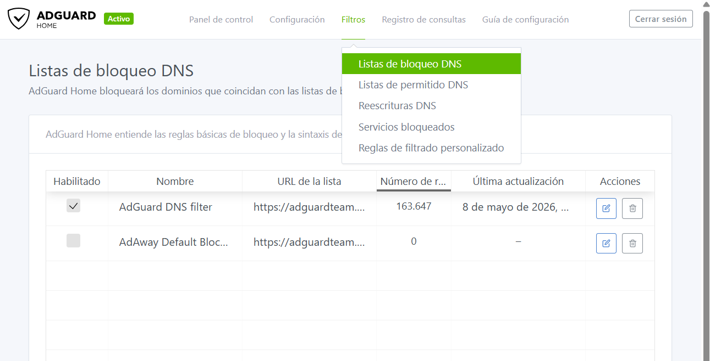
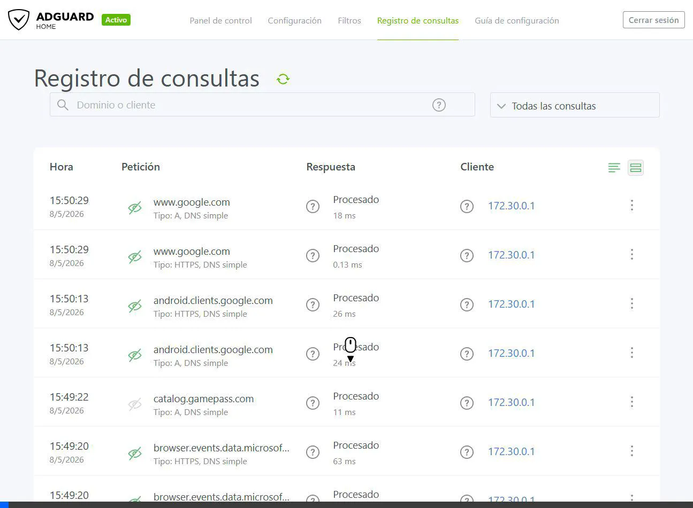
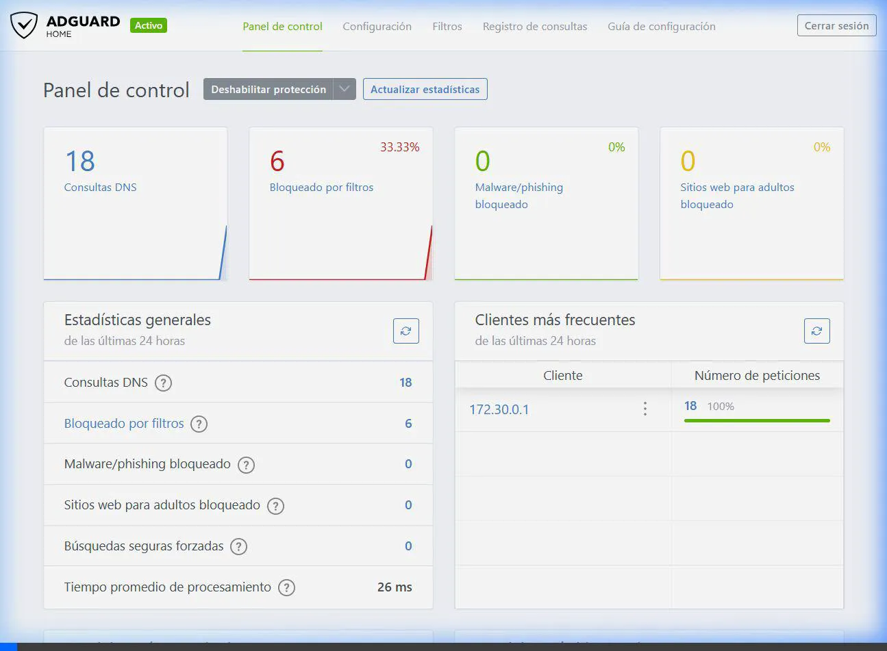

# 🛡️ AdGuard Home: DNS Sinkhole y Bloqueo de Rastreadores a Nivel de Red

Bienvenido a la documentación de este proyecto, donde se implementa un **DNS Sinkhole** (Sumidero DNS) utilizando **AdGuard Home** desplegado a través de **Docker**. 

El objetivo principal de esta infraestructura es proporcionar una capa de seguridad y privacidad a nivel de red, interceptando las solicitudes a dominios asociados con publicidad intrusiva, rastreadores web (trackers) y malware, antes de que lleguen a los dispositivos clientes.

---

## 📖 Índice
1. [¿Qué es AdGuard Home y cómo funciona?](#-qué-es-adguard-home-y-cómo-funciona)
2. [Arquitectura y Despliegue con Docker](#-arquitectura-y-despliegue-con-docker)
3. [Configuración a Nivel de Sistema Operativo](#-configuración-a-nivel-de-sistema-operativo)
4. [Demostración de Filtrado DNS](#-demostración-de-filtrado-dns)
5. [Panel de Control y Monitoreo](#-panel-de-control-y-monitoreo)
6. [Recuperación y Mantenimiento](#-recuperación-y-mantenimiento)

---

## 🧠 ¿Qué es AdGuard Home y cómo funciona?

Cuando navegas por internet, tu ordenador necesita traducir nombres de dominio legibles por humanos (como `google.com`) a direcciones IP legibles por máquinas (como `142.251.142.142`). Este proceso lo realiza un servidor **DNS (Domain Name System)**.

**AdGuard Home** actúa como tu propio servidor DNS personal. Cuando una aplicación o navegador intenta acceder a un dominio, AdGuard Home comprueba esa solicitud contra una lista de filtros (Blacklists) de publicidad y telemetría actualizadas en tiempo real:
- **Si el dominio es legítimo:** AdGuard consulta a un servidor externo (como Cloudflare o Google) y devuelve la IP correcta.
- **Si el dominio es malicioso o publicitario:** AdGuard bloquea la solicitud y devuelve `0.0.0.0` (un agujero negro o *sinkhole*), evitando que tu dispositivo se conecte, ahorrando ancho de banda y protegiendo tu privacidad de forma transparente.

### Las Listas de Inteligencia contra Amenazas

Para realizar estos bloqueos, el sistema se apoya en listas mantenidas por la comunidad que se actualizan automáticamente:



---

## 🐳 Arquitectura y Despliegue con Docker

Para garantizar la portabilidad y el aislamiento del servicio, se ha optado por un despliegue en contenedores usando `Docker Compose`.

### El archivo `docker-compose.yml`

```yaml
version: '3.3'
services:
  adguardhome:
    image: adguard/adguardhome
    container_name: adguardhome
    restart: unless-stopped
    ports:
      - "53:53/tcp"
      - "53:53/udp"
      - "3000:3000/tcp"
      - "8080:80/tcp"
    volumes:
      - ./workdir:/opt/adguardhome/work
      - ./confdir:/opt/adguardhome/conf
```

**Explicación de la configuración:**
* **`image`**: Utiliza la imagen oficial de AdGuard.
* **`restart: unless-stopped`**: Garantiza que el servidor DNS se inicie automáticamente si se reinicia el sistema, asegurando alta disponibilidad.
* **`ports`**:
  * **Puerto 53 (TCP/UDP)**: El puerto estándar para todas las comunicaciones DNS. Por aquí entran las consultas del equipo.
  * **Puerto 8080**: Redireccionado internamente al 80. Sirve el panel de administración web, cambiado para evitar conflictos con otros servidores web locales (como Apache o Nginx).
  * **Puerto 3000**: Usado temporalmente para el setup inicial.
* **`volumes`**: Mapeos locales (`./workdir` y `./confdir`) que garantizan la persistencia de datos (estadísticas, reglas de bloqueo personalizadas, etc.) aunque se destruya el contenedor.

---

## ⚙️ Configuración a Nivel de Sistema Operativo

Una vez desplegado el contenedor, la máquina local no utilizará automáticamente este DNS. Para completar la integración, el tráfico del sistema operativo se enrutó forzosamente a través de nuestro nuevo DNS local (`127.0.0.1`).

Esto se realizó modificando la configuración del adaptador de red primario (`Wi-Fi`) mediante **PowerShell** con privilegios administrativos:

```powershell
# Enrutamiento de todo el tráfico DNS al contenedor local
Set-DnsClientServerAddress -InterfaceAlias "Wi-Fi" -ServerAddresses "127.0.0.1"
```

A partir de la ejecución de este comando, **cada petición de la máquina es auditada por AdGuard Home**.

---

## 🎯 Demostración de Filtrado DNS

Para evidenciar científicamente que el bloqueo a nivel de red está activo, se han ejecutado pruebas de resolución de nombres directamente a través de comandos del sistema (`Resolve-DnsName`), saltándose la caché del navegador para obtener resultados limpios.

### Prueba 1: Resolución de un dominio legítimo
Consultamos `google.com` para comprobar que la navegación general sigue activa.

```powershell
PS> Resolve-DnsName -Name google.com -Server 127.0.0.1

Name                                           Type   TTL   Section    IPAddress                                
----                                           ----   ---   -------    ---------                                
google.com                                     A      102   Answer     142.251.142.142   
```
✅ **Resultado:** AdGuard Home resuelve la petición devolviendo la dirección IP real de los servidores de Google.

### Prueba 2: Resolución de un dominio publicitario / rastreador (Sinkhole en acción)
Consultamos `ad.doubleclick.net`, un conocido servidor masivo de anuncios y telemetría de Google.

```powershell
PS> Resolve-DnsName -Name ad.doubleclick.net -Server 127.0.0.1

Name                                           Type   TTL   Section    IPAddress                                
----                                           ----   ---   -------    ---------                                
ad.doubleclick.net                             AAAA   10    Answer     ::                                       
ad.doubleclick.net                             A      10    Answer     0.0.0.0 
```
🚫 **Resultado:** El dominio está presente en el "AdGuard DNS filter" activo. El servidor intercepta la petición y aplica la acción de Sinkholing, devolviendo la IP vacía `0.0.0.0`. Las aplicaciones que intenten descargar publicidad de este dominio fallarán instantáneamente, logrando un bloqueo silencioso y eficiente.

### Vista desde el Registro de Consultas (Query Log)
El bloqueo y la resolución legítima también son visibles de forma granular y en tiempo real a través del panel de registros:



---

## 📊 Panel de Control y Monitoreo

AdGuard Home proporciona una interfaz web de gestión accesible localmente, donde se pueden visualizar métricas avanzadas, como los clientes más activos, el ratio de dominios bloqueados frente a permitidos, el tiempo medio de procesamiento por consulta, y registros (logs) detallados en tiempo real.

A continuación, la evidencia de captura visual demostrando el funcionamiento en vivo del panel bajo tráfico de red (accesible en `http://localhost:8080`):



---

## 💡 Explicación de Decisiones Técnicas

Para cumplir estrictamente con los requisitos del proyecto, se han tomado las siguientes decisiones de diseño:

1. **Configuración de Xarxa (Red):** 
   - Se expuso el puerto `53` para las consultas DNS estándar.
   - Se mantuvo expuesto el puerto `3000` (utilizado para la fase de instalación de AdGuard) y se mapeó el panel de control (Dashboard) al puerto `8080` de la máquina anfitriona para asegurar el acceso web sin entrar en conflictos de puertos.
   - El equipo anfitrión se configuró para usar `127.0.0.1` como DNS principal. Esta decisión obliga a que todo el tráfico local pase obligatoriamente por el contenedor Docker antes de salir a internet.

2. **Listas Triadas (Filtros de Bloqueo):**
   - Se ha mantenido activa la lista oficial **"AdGuard DNS filter"**. 
   - *¿Por qué?* Es una lista mantenida de forma muy activa que equilibra perfectamente el bloqueo agresivo de rastreadores (trackers) y dominios de publicidad (como `doubleclick.net`) sin llegar a causar falsos positivos que rompan el funcionamiento normal de las páginas web que el usuario visita a diario.

---

## 🔧 Recuperación y Mantenimiento

En infraestructuras de este tipo, la dependencia del contenedor Docker es absoluta para la resolución de nombres. Si el contenedor se detiene accidentalmente, la máquina se quedará sin acceso a Internet. 

**Para restaurar la conexión a Internet automáticamente (eliminar el bloqueo):**
Si necesitas revertir los cambios y volver al DNS dinámico de tu ISP, ejecuta en PowerShell como Administrador:
```powershell
Set-DnsClientServerAddress -InterfaceAlias "Wi-Fi" -ResetServerAddresses
```

**Para acceder al administrador de AdGuard:**
- URL: `http://localhost:8080`
- Credenciales configuradas por defecto: *admin* / *admin123* (Cambiar en caso de llevar a producción).
